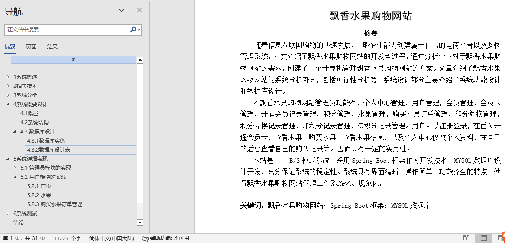
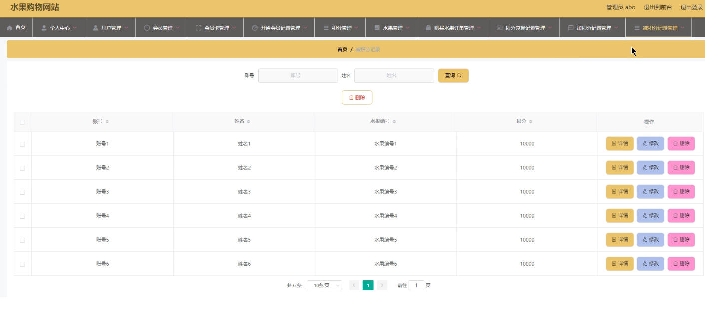
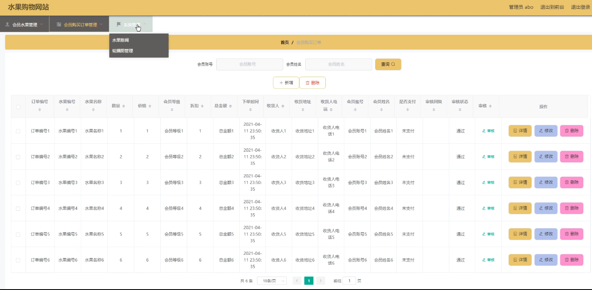
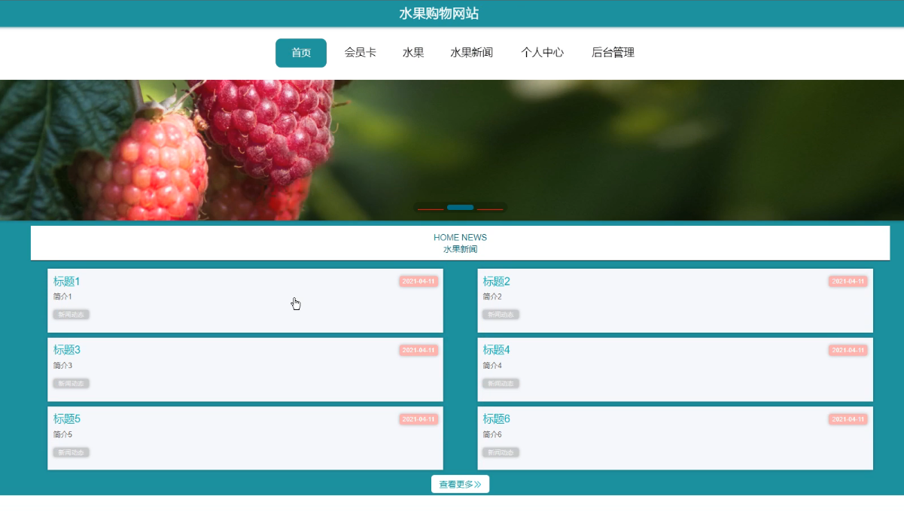
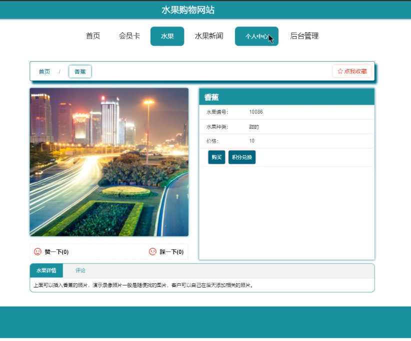
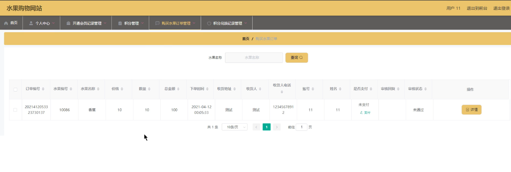
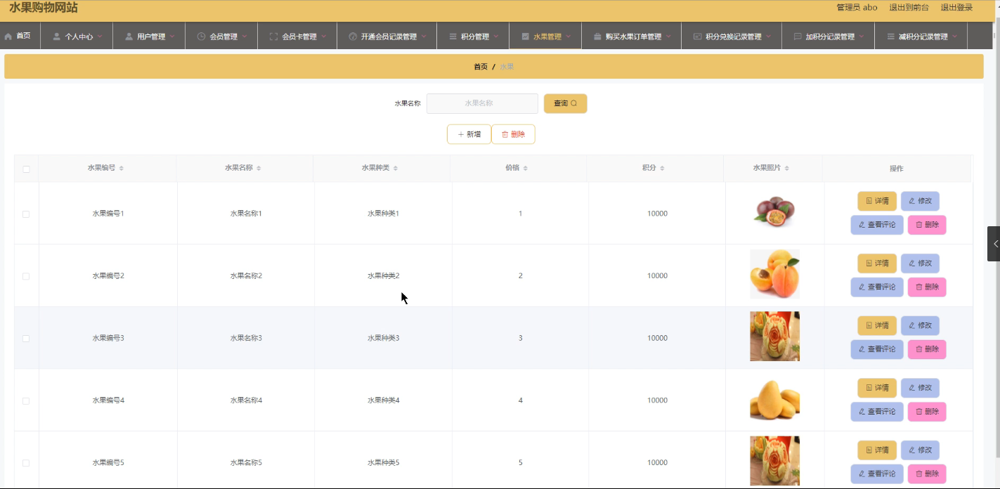

## 飘香水果购物网站系统(程序+报告)

###  获取sql数据库文件: 从戎源码网 (https://armycodes.com/) QQ: 386869957 QQ群: 377586148
###  所有系统地址: (https://github.com/YuLin-Coder/AllProjectCatalog) 
###  所有项目以及源代码本人均调试运行无问题 可支持远程安装部署调试、定制修改、代码讲解

## 项目介绍
飘香水果购物网站系统，包含两种角色：用户、管理员，系统分为前台和后台两大模块，主要功能如下：

1管理员模块的实现

水果信息管理
飘香水果购物网站的系统管理员可以管理水果，对水果信息进行添加、修改和删除操作。

减积分管理
系统管理员可以对减积分进行添加、修改和删除操作。

会员购买订单管理
系统管理员可以对用户提交的订单进行审核和删除操作。

2用户模块的实现

首页
用户登录后，可以查看首页，首页会显示水果新闻。

水果
用户登录后，点击水果，可以查看水果信息并进行购买操作。

购买水果订单管理
用户登录后可以在个人后台查看属于自己的购买水果订单管理。

## 项目技术
- 编程语言：Java
- 数据库：MySQL
- 项目管理工具：Maven
- 前端技术：HTML、CSS、JavaScript、Vue
- 后端技术：Spring、SpringMVC、MyBatis

## 运行环境
- JDK版本：JDK1.8及以上
- 开发工具：IDEA、Ecplise、Myecplise都可以
- 数据库: MySQL5.7及以上
- Maven：maven3.0及以上
- Node：14.14.0及以上

## 运行截图

